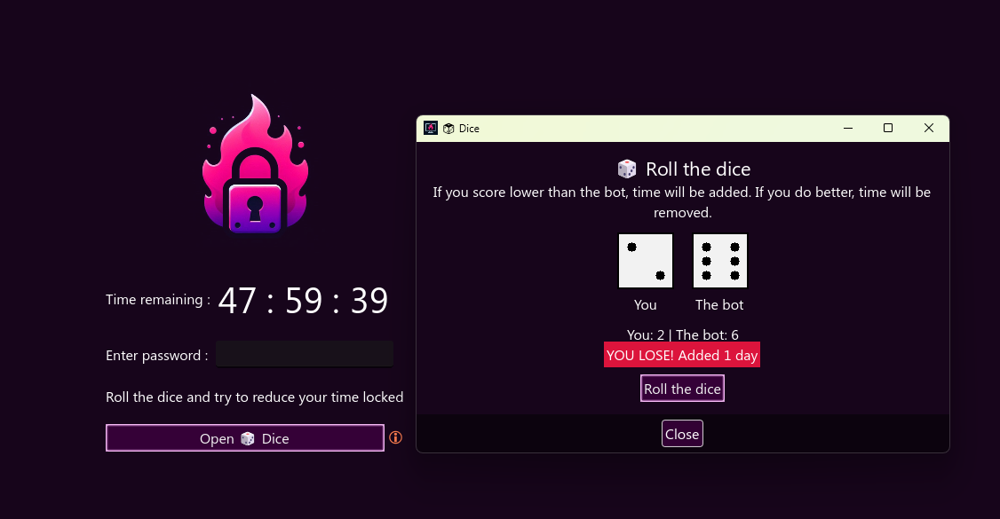
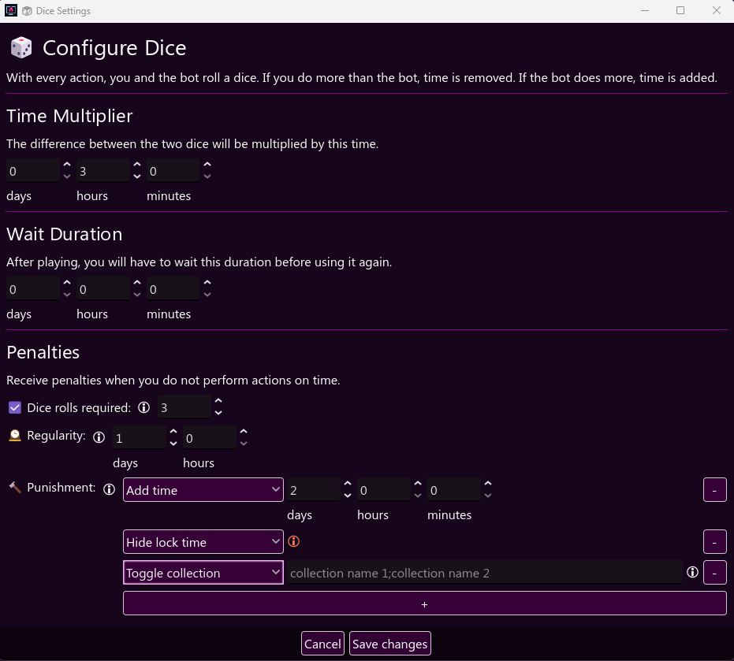
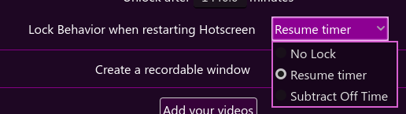

# 🔐 Lock and Play Mod for Hotscreen

**Lock and Play** is a mod for **Hotscreen** extending the lock mechanism by adding games that trigger different actions depending on the result; toggle collections for example or add time to the lock when losing.

---

## 📌 About the Mod

Each game has it's own game window and settings window. Right now there's only one game: Dice. But more is coming!
The intended way of using this mod is with Hotscreen auto-starting on windows boot, with a lock behavior of either `Resume Timer` or `Subtract Off Time` when Hotscreen is restarting.

### Dice Game
Roll the dice against the computer. If you score lower than the bot, time will be added. If you do better, time will me removed.
#### Dice Settings
- Set a time multiplier: the difference between the two dice will be multiplied by this time
- (Optional) Set a wait duration: after playing, you will have to wait this duration before playing again
  - (Optional) Penalties: Receive penalties from the Actions list if you do not play the game in time
  - How many times you have to play the game
  - Regularity: how often do you need to play
  - Punishments: from adding time, to toggling collection, to OS commands
  
---

## 📥 Actions

- Add / Remove time to the lock
- Enable / Disable / Toggle collections from a list
- Toggle random collections from a list
- Level up / down collections
- Hide / Show / Toggle visibility of the countdown
- OS Commands to launch for example edgeware++ when you lose (disabled for now until I'm done testing it more)

---

## 🖼️ Screenshots

### Dice Game

### Dice Settings

---

## ⛔ Limitations

The prefered lock behavior to use with the mod right now is `Resume Timer` (also `No Lock` will work too). `Subtract Off Time` is not working as intended yet (the lock will unlock itself the next time Hotscreen is resumed if the countdown goes to 0 while Hotscreen wasn't running)

---

## ⚠️ Warning

- Always test and try things out, make sure you understand how everything work and only lock yourself when you're completely sure of both your collection settings and this mod settings.
- If you lock yourself, always be safe and use a password. I use this web app to get a random password that will unlock itself after a certain amount of time: 🔗 [lockmeout.online](https://lockmeout.online)

---

## 📅 What's coming soon

- Wheel of fortune game with customizable slices that triggers actions
- Lock History to better understand what is happening
- Actions
  - Freeze / Unfreeze / Toggle freeze lock
  - Integration with the Money Paywall collection
- Encryption of the lock session file to protect from tampering (will probably be optional)
- Syncing for multiple screens (I haven't started yet but I feel this is needed)
- More games!
  
---

## 🧠 Future Game Ideas
- a store system where you can spend points gained from games (and maybe other mods) to obtain rewards (lower censor intensity for 1 hour for example, unban certain websites, ...)
- puzzle with user provided image library
- mine
- slot machine
- Image Flip Matching memory game
- reskinned snake game (hypno edition)
- reskinned 2048 (gooner themed edition)

---

## 🚀 Installation

1. Download 🔗 [Hotscreen](https://perfectfox265.itch.io/hotscreen) and get familiar with it
2. Download or clone this repository
3. Move the files anywhere inside `./CUSTOM_DATA` in your Hotscreen folder

---

## 🛠️ Development Notes
- Made for Hotscreen >0.8
- Written with Godot 4.4
- Fully written by hand (for better or worse)
- The mod uses it's own locked session save file
- The mod also uses it's own logs file separated from Hotscreen to not clog it (situated in the `LockAndPlay folder` > `logs`)
 
---

## 🎮 Original Project

This mod is built on top of: 🔗 [Hotscreen](https://perfectfox265.itch.io/hotscreen)

> Huge credit to perfectfox265, Hotscreen's developper, for making this awesome program and opening it to mods.